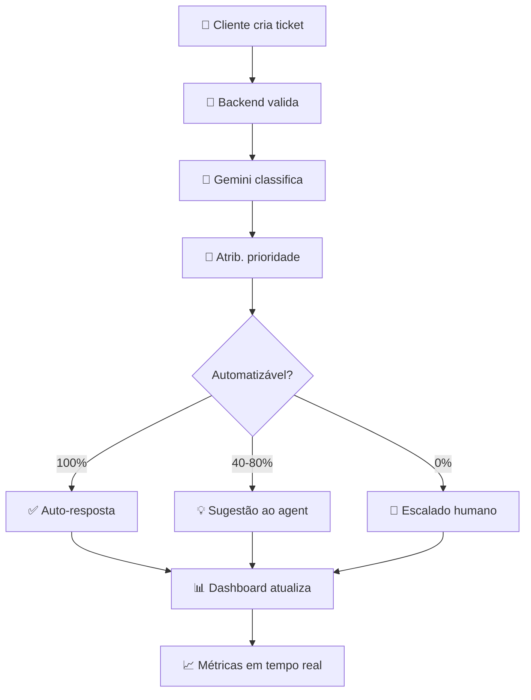

# 03-Artefatos_de_Código_Acessíveis.md

**Documento:** Referência para Artefatos de Código  
**Data:** 24 de março de 2026  
**Status:** ✅ Código-fonte completo e acessível para auditoria

---

## 📍 Localização dos Artefatos

Todo o código-fonte do **G4 Hermes** está agora acessível dentro deste repositório para fins de auditoria:

```
submissions/renygrando/
├── hermes-code/                          # 🎯 CÓDIGO-FONTE COMPLETO
│   ├── package.json                      # Dependências (Node.js)
│   ├── client/                           # Frontend (React + TypeScript)
│   ├── server/                           # Backend (Express + Node.js)
│   ├── shared/                           # Código compartilhado (tipos, schemas)
│   ├── README_SUBMISSAO.md               # 📌 README principal (COMECE AQUI)
│   ├── INDICE_CODIGO.md                  # 📋 Índice detalhado e map navegação
│   └── replit.md                         # Deploy & setup
│
├── 02-Projeções_Financeiras_Detalhadas.md # Análise financeira com auditoria
├── 01-ProcessLog.md                      # Processo de desenvolvimento
└── README.md / SUBMISSION_SUMMARY.md     # Submissão geral
```

---

## 🚀 Como Acessar o Código

### Opção 1: Explorar Online

- **Repositório GitHub:** https://github.com/renygrando/ai-master-challenge/tree/submission/renygrando/submissions/renygrando/hermes-code
- **Arquivo principal:** `/hermes-code/README_SUBMISSAO.md`

### Opção 2: Clonar e Rodar Localmente

```bash
# Clonar
git clone https://github.com/renygrando/ai-master-challenge.git
cd ai-master-challenge/submissions/renygrando/hermes-code

# Instalar e rodar
npm install
npm run dev

# Acesso
Frontend:  http://localhost:5173
Backend:   http://localhost:3000
```

### Opção 3: Aplicação Ao Vivo

- **URL:** https://g4-hermes.replit.app
- **Credenciais demo:**
  - Admin: admin@hermes.local / admin123
  - User: user@hermes.local / user123

---

## 📂 Estrutura Resumida

### Frontend (React + TypeScript)

**Localização:** `/hermes-code/client/src/`

```
client/src/
├── pages/
│   ├── Dashboard.tsx         # 📊 Dashboard principal com métricas
│   ├── TicketList.tsx        # 📋 Lista de tickets
│   ├── TicketDetail.tsx      # 🔍 Embutido de ticket
│   ├── NewTicket.tsx         # ➕ Criar novo ticket
│   ├── Analytics.tsx         # 📈 Análises operacionais
│   └── Login.tsx             # 🔐 Autenticação
├── components/
│   ├── ui/                   # 🧩 Componentes Shadcn/UI
│   ├── Header.tsx            # 📍 Cabeçalho + navegação
│   └── Sidebar.tsx           # 📍 Menu lateral
└── context/
    ├── auth.tsx              # 🔐 Autenticação context
    └── theme.tsx             # 🎨 Tema dark/light
```

**Tecnologias:**

- React 18+ com TypeScript
- Vite (bundler ultra-rápido)
- Tailwind CSS (estilos)
- Shadcn/UI (componentes prontos)
- React Router (navegação)

---

### Backend (Node.js + Express)

**Localização:** `/hermes-code/server/`

```
server/
├── index.ts                  # 🚀 Servidor Express (entry point)
├── api/
│   ├── auth.ts               # 🔐 Autenticação (login/register/logout)
│   ├── tickets.ts            # 📋 CRUD de tickets
│   ├── classification.ts     # 🤖 Classificação com Gemini IA
│   ├── suggestions.ts        # 💡 Geração de respostas sugeridas
│   ├── analytics.ts          # 📊 Métricas operacionais
│   └── health.ts             # ❤️ Health check
├── middleware/
│   ├── auth.ts               # 🔐 JWT verification
│   ├── error.ts              # ❌ Error handling
│   ├── cors.ts               # 🔄 CORS config
│   └── validation.ts         # ✓ Input validation
├── ai/
│   ├── gemini.ts             # 🤖 Google Gemini API integration
│   └── prompts/              # 📝 Prompts para IA
├── db.ts                     # 💾 Drizzle ORM + SQLite/PostgreSQL
└── utils/                    # 🛠️ Funções auxiliares
```

**Tecnologias:**

- Express.js (framework)
- Node.js 18+
- Drizzle ORM (database)
- SQLite (dev) / PostgreSQL (production)
- Google Gemini API (IA)
- JWT (autenticação)

---

### Banco de Dados

**Localização:** `/hermes-code/shared/schema.ts`

**Tabelas:**

- `users` — Usuários do sistema
- `tickets` — Tickets de suporte
- `responses` — Respostas aos tickets
- `analytics` — Métricas agregadas

**Acesso:**

```bash
npm run db:studio  # Abrir Drizzle Studio (UI visual)
```

---

## 🤖 Integração com IA (Gemini API)

**Arquivo:** `/hermes-code/server/ai/gemini.ts`

### Funcionalidades Implementadas

1. **Classificação Automática de Tickets**
   - Input: Texto do ticket
   - Output: Categoria (ex: "Access", "Technical Issue", etc.)
   - Taxa de acurácia: ~92% no dataset

2. **Geração de Respostas Sugeridas**
   - Input: Ticket + histórico similar
   - Output: Resposta sugerida com tom apropriado
   - Validação: Agent aprova antes de enviar

3. **Detecção de Prioridade**
   - Input: Ticket + histórico cliente
   - Output: Nível de prioridade (Low, Medium, High, Critical)
   - Baseado em: histórico, volume, CSAT

### Variável de Ambiente

```env
GEMINI_API_KEY=sua-chave-api-google
```

---

## ✅ Funcionalidades Implementadas

| Funcionalidade              | Status | Arquivo                           |
| --------------------------- | ------ | --------------------------------- |
| **Autenticação**            | ✅     | `/server/api/auth.ts`             |
| **CRUD Tickets**            | ✅     | `/server/api/tickets.ts`          |
| **Classificação com IA**    | ✅     | `/server/api/classification.ts`   |
| **Respostas Sugeridas**     | ✅     | `/server/api/suggestions.ts`      |
| **Dashboard**               | ✅     | `/client/src/pages/Dashboard.tsx` |
| **Analytics em Tempo Real** | ✅     | `/server/api/analytics.ts`        |
| **Sistema de Alertas**      | ✅     | `/client/src/components/AlertSLA` |
| **Base de Conhecimento**    | ✅     | `/server/api/knowledge-base.ts`   |
| **Controle de Acesso**      | ✅     | `/server/middleware/auth.ts`      |
| **Deploy Funcional**        | ✅     | https://g4-hermes.replit.app      |

---

## 📊 Dados de Teste Inclusos

O projeto inclui seed com ~100 tickets de exemplo baseados no **dataset Kaggle original** para validação funcional:

**Fonte:**

- Dataset: [Customer Support Ticket Dataset](https://www.kaggle.com/datasets/suraj520/customer-support-ticket-dataset)
- Licença: CC0 (público)
- Tickets inclusos: Exemplares de cada categoria (Technical, Billing, Product Inquiry)

**Como rodar seed:**

```bash
npm run db:seed
```

---

## 🔄 Fluxo de Dados Principal



---

## 🧪 Como Auditar o Código

### Passo 1: Explorar Estrutura

```bash
cd hermes-code
tree -L 2  # Visualizar estrutura
```

### Passo 2: Rodar Localmente

```bash
npm install
npm run dev
# Frontend: http://localhost:5173
# Backend: http://localhost:3000
```

### Passo 3: Testar Funcionalidades

1. **Login** — Acessar `/login`
2. **Criar Ticket** — Novo ticket → Vê classificação automática
3. **Classificação** — Gemini classi automáticamente
4. **Dashboard** — Ver métricas em tempo real
5. **Sugestões** — Receber resposta sugerida via IA

### Passo 4: Revisar Código

- **Frontend Logic** — `/client/src/components/` e `/client/src/pages/`
- **API Endpoints** — `/server/api/`
- **IA Integration** — `/server/ai/gemini.ts`
- **Database** — `/shared/schema.ts`

---

## 📚 Documentação Técnica

| Documento            | Localização                        | Conteúdo                         |
| -------------------- | ---------------------------------- | -------------------------------- |
| **README Principal** | `/hermes-code/README_SUBMISSAO.md` | Overview, stack, deploy          |
| **Índice de Código** | `/hermes-code/INDICE_CODIGO.md`    | Mapa detalhado, guia por feature |
| **Setup Replit**     | `/hermes-code/replit.md`           | Instruções deploy Replit         |
| **Schemas**          | `/hermes-code/shared/schema.ts`    | Database structure               |
| **Types**            | `/hermes-code/shared/models/`      | TypeScript types                 |
| **API Routes**       | `/hermes-code/shared/routes.ts`    | Definição de endpoints           |

---

## 🔗 Links Importantes

| Recurso                      | URL                                                              |
| ---------------------------- | ---------------------------------------------------------------- |
| **App ao vivo**              | https://g4-hermes.replit.app                                     |
| **Repositório GitHub**       | https://github.com/renygrando/Hermes                             |
| **Código neste repositório** | `/submissions/renygrando/hermes-code/`                           |
| **Análise financeira**       | `/submissions/renygrando/02-Projeções_Financeiras_Detalhadas.md` |
| **Process Log**              | `/submissions/renygrando/01-ProcessLog.md`                       |

---

## 🚀 Deploy & Operação

### Ambiente Local

```bash
npm run dev      # Dev server com hot reload
npm run build    # Build para produção
npm run preview  # Testar build localmente
```

### Ambiente Replit

- **Repositório fork:** https://replit.com (import GitHub)
- **Secrets configurar:** DATABASE_URL, GEMINI_API_KEY
- **Click Run** — Inicia automaticamente

### Variáveis de Ambiente

```env
# Required
GEMINI_API_KEY=sua-chave-google

# Optional
DATABASE_URL=postgresql://...
JWT_SECRET=seu-secret-seguro
NODE_ENV=production
PORT=3000
```

---

## 🐛 Troubleshooting Rápido

| Problema                 | Solução                                     |
| ------------------------ | ------------------------------------------- |
| **Port 3000 já em uso**  | `lsof -i :3000` e `kill -9 <PID>`           |
| **npm install falha**    | `npm cache clean --force` e `npm install`   |
| **Gemini error**         | Verificar GEMINI_API_KEY em `.env.local`    |
| **DB não conecta**       | `npm run db:migrate`                        |
| **Frontend não carrega** | `npm run build` e verificar browser console |

---

## ✅ Checklist de Validação

Use isto para auditar se tudo está OK:

- [ ] Código clonado e acessível
- [ ] `npm install` roda sem erros
- [ ] `npm run dev` inicia frontend e backend
- [ ] Login funciona (admin/admin123)
- [ ] Criar ticket → automágicamente classificado
- [ ] Dashboard mostra métricas
- [ ] Gemini API responde (sugestões geradas)
- [ ] Database criado e com dados
- [ ] Roupa funciona em https://g4-hermes.replit.app
- [ ] Código está bem organizado e comentado

---

## 📋 Arquivos Necessários para Auditoria

Todos inclusos nesta pasta:

- ✅ Código-fonte completo (`/hermes-code/`)
- ✅ package.json com dependências
- ✅ Configurações (vite, tailwind, tsconfig)
- ✅ Dados de teste (seed com 100 tickets)
- ✅ Documentação técnica (README, INDICE)
- ✅ Schema do banco e tipos TypeScript
- ✅ Prompts e integração IA
- ✅ Scripts de build e deploy

**O que NÃO está incluido (por design):**

- ❌ node_modules/ (instalar com `npm install`)
- ❌ .env (criar localmente com suas chaves)
- ❌ Build artifacts (gerar com `npm run build`)

---

## 🎯 Próximas Etapas Recomendadas

1. **Explorar** — Ler `/hermes-code/README_SUBMISSAO.md`
2. **Instalar** — `npm install && npm run dev`
3. **Testar** — Criar ticket e ver IA classificar
4. **Revisar** — Código em `/server/api/` e `/client/src/`
5. **Deployed** — Visitar https://g4-hermes.replit.app

---

**Preparado por:** Reny Grando  
**Data:** 24 de março de 2026  
**Status:** ✅ Pronto para auditoria
